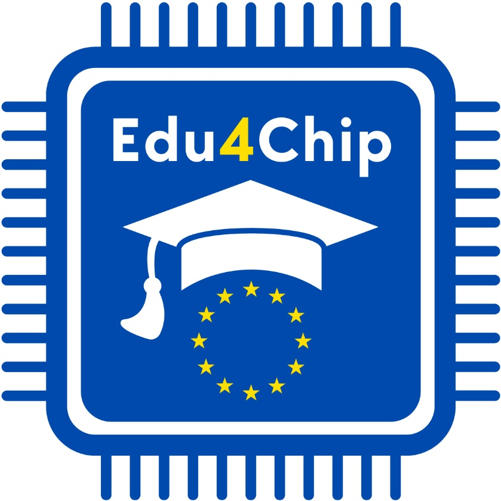

# Edu4Chip
This is the collaboration platform for the project [Edu4Chip](https://edu4chip.github.io/).

It serves as a collaborative space for students, researchers, and industry, and holds the common chip design templates, code, and design files for the digital, analog, and mixed-signal integrated circuits, as well as documentation and tutorials to guide users through the entire chip design flow. Explore the repository and join our growing community of future chip designers.

Visit the [Edu4Chip](https://edu4chip.github.io/) website to know more.

  
  
  

 

 
 
 
 
 
 
 
 
 
 
 
 
 

### Disclaimer
The project is funded by the European Union. Views and opinions expressed are however those of the author(s) only and do not necessarily reflect those of the European Union or the European Health and Digital Executive Agency (HADEA). Neither the European Union nor the granting authority can be held responsible for them.

